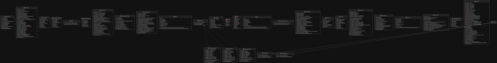
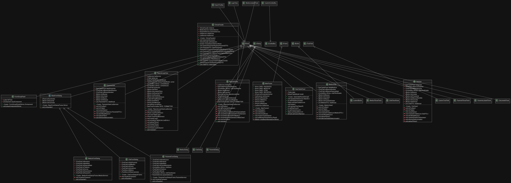

# Manual Técnico -  Gestion Clínica Médica
### *Universidad San Carlos de Guatemala - Division Ciencias de la Ingeniería - Centro Universitario de Occidente (CUNOC)*
### *Manejo e Implementación de Archivos*

---

## 1. Tecnologías utilizadas
- Intellij IDE versión 2025.2.6.2 
- Java version 21.0.11-temurin
- Maven version 3.9.12 (non_canonical)
- Sistema Operativo: Solus Linux

## 2. Arquitectura del Sistema
Este sistema está basado en una arquitectura por capas permitiendo la escalabilidad e implementación de nuevas funcionalidades de forma sencilla. Se ha implementado el Facade Pattern que permite la comunicación entre el FrontEnd y Backend mediante metodos, así permitimos un bajo acoplamiento en el frontend.

---

## 3. Diagrama de clases

-**Backend**
Este diagrama representa las clases que conforman el Backend del sistema. En estas clases vive la lógica de negocio así como la capa de persistencia.


-**Frontend**
Este diagrama representa las clases que conforman el Frontend. Aquí se encuentra el Facade pattern que permite una limpia gestion de llamadas entre los services de nuestra capa de persistencia con la GUI.


## 4. Persistencia de Datos
Para la persistencia de los datos se utilizó un sistema híbrido basado en archivos de acceso aleatorio (RandomAccessFile) que combina diferentes estrategias de organización para optimizar el rendimiento según las necesidades de cada entidad.

### 4.1 Tipos de Organización de Archivos Implementados
#### Archivo de Anillo (Ring File) con Bitmap

Utilizado para el almacenamiento principal de todas las entidades.

Características:

    Registros de tamaño fijo

    Bitmap de 1 byte por registro para marcar ocupado/libre

    Reutilización de espacios liberados

    Soft Delete implementado (los registros no se eliminan físicamente)

Estructura del registro:
```
[Bitmap (1 byte)] + [Datos del registro (tamaño fijo)]
```

 Ventajas:

    Inserción O(1) - se reutilizan espacios libres

    Eliminación O(1) - solo se marca como libre en el bitmap

    Sin fragmentación del archivo

    Tamaño predecible del archivo

    Permite auditoría completa (soft delete)

#### Archivo Indexado (Indexed File)

Utilizado para búsquedas rápidas por identificadores únicos.

Características:

    Índice separado que mapea clave → posición física

    Búsquedas O(1) en lugar de O(n)

    Mantenimiento de índices al insertar/actualizar

Estructura del índice:
```
[Clave (tamaño fijo)] + [Posición (long)]
```

#### Archivo de Texto con Tamaño Fijo

Utilizado para el sistema de logs.

Características:

    Registros de texto con tamaño fijo (500 caracteres)

    Cada entrada tiene formato estructurado

    Fácil de leer y exportar a CSV

    Formato de cada entrada:
```
[2026-08-25 14:30:15] | USUARIO: admin | MODULO: Médicos | ACCION: CREACIÓN | DETALLE: ... | ID: ...

```


### 4.2 Estructura de Directorios
```
data/
├── medicos/
│   ├── medicos.dat                    # Datos en anillo
│   ├── medicos_idx_uuid.dat          # Índice UUID → posición
│   └── medicos_idx_especialidad.dat  # Índice especialidad → posiciones
├── pacientes/
│   ├── pacientes.dat                  # Datos en anillo
│   ├── pacientes_idx_identificacion.dat # Índice identificación → posición
│   └── pacientes_idx_tipo_sangre.dat   # Índice tipo sangre → posiciones
└── citas/
    ├── citas.dat                      # Datos en anillo
    ├── citas_idx_uuid.dat             # Índice UUID → posición
    ├── citas_idx_paciente.dat         # Índice paciente → posiciones
    ├── citas_idx_medico.dat           # Índice médico → posiciones
    ├── citas_idx_fecha.dat            # Índice fecha → posiciones
    └── citas_idx_estado.dat           # Índice estado → posiciones
```

### 4.3 Componentes de Persistencia

#### RingFileHandler

Maneja el archivo de anillo y el bitmap de espacios libres.

Métodos principales:

    obtenerEspacioLibre() - Obtiene la siguiente posición disponible

    marcarEstado(raf, ocupado) - Marca un registro como ocupado/libre

    estaOcupado(raf) - Verifica si un registro está ocupado

    liberarEspacio(posicion) - Libera un espacio (soft delete)

    recargarEspaciosLibres() - Recarga la caché de espacios libres

#### IndexHandler

Maneja índices simples (clave única → posición).

Métodos principales:

    agregar(clave, posicion) - Agrega una entrada al índice

    buscar(clave) - Busca una clave y retorna la posición

    eliminar(clave) - Elimina una entrada del índice

    cargarTodos() - Carga todo el índice en memoria

#### SecondaryIndexHandler

Maneja índices secundarios (clave → lista de posiciones).

Métodos principales:

    agregar(clave, posicion) - Agrega una posición a una clave

    buscar(clave) - Retorna todas las posiciones de una clave (solo ocupadas)

    eliminar(clave, posicion) - Elimina una posición de una clave

    cargarTodos() - Carga todo el índice en memoria


### 4.4 Estrategia de Soft Delete

Todos los registros utilizan Soft Delete:

    Los registros se marcan como libres en el bitmap (raf.writeBoolean(false))

    NO se eliminan físicamente del archivo

    NO se eliminan de los índices (se mantienen para auditoría)

    Las búsquedas filtran automáticamente los registros libres

    Permite recuperación de datos si es necesario

    Mantiene integridad del historial

```java
public void eliminarMedico(UUID id) {
    // 1. Marcar como libre en el bitmap
    ringHandler.liberarEspacio(posicionRegistro);
    
    // 2. NO eliminar de índices (soft delete)
    // Los índices mantienen las entradas para auditoría
    
    // 3. Limpiar caché (opcional)
    cacheUuidPosicion.remove(uuidStr);
}
```

### 4.5 Almacenamiento en Caché

El sistema utiliza caché en memoria para mejorar el rendimiento:

Estructuras de caché:
```java
// Para índices primarios
Map<String, Long> cacheIdPosicion;

// Para índices secundarios
Map<String, List<Long>> cacheAtributoPosiciones;
```
Beneficios:

    Búsquedas O(1) sin acceso a disco

    Reducción de operaciones de I/O

    Recarga automática al inicio y bajo demanda